# api.kolodahearthstone.com

[](https://github.com/Manacost-Labs/api.kolodahearthstone.com/actions/workflows/tests.yml)

Кэширующий парсер, REST и GraphQL API для статистики Hearthstone. Сервис собирает данные
из HSReplay, HSGuru, Firestone, MetaStats, Hearthstone-Decks, HearthArena и
Vicious Syndicate, проверяет их качество и публикует нормализованные JSON-срезы.

- Production API: <https://api.kolodahearthstone.com>
- Репозиторий: <https://github.com/Manacost-Labs/api.kolodahearthstone.com>
- Каталог данных: [docs/DATA_CATALOG.md](docs/DATA_CATALOG.md)
- Полная документация API: [docs/API.md](docs/API.md)
- GraphQL: [docs/GRAPHQL_API.md](docs/GRAPHQL_API.md)
- Токены и scopes: [docs/API_TOKENS.md](docs/API_TOKENS.md)

> `GET /health` проверяет только доступность API. Он не гарантирует, что все
> парсеры успешно обновились и данные свежие. Для полной проверки используйте
> `freshness-check`, `quality-check` и `/ops/summary`.

## Что находится в системе

Репозиторий содержит не только сборщики и единый API, но и исходники закрытой
веб-панели в [`panel/`](panel/README.md). На production панель открывается на
корне `api.kolodahearthstone.com`, защищена GitHub OAuth и разрешает вход только
пользователю `Zulut30`. Код панели разворачивается атомарно, а её конфигурация,
изображения и рабочие кеши хранятся вне Git.

В текущем реестре **99 источников: 93 scrape + 6 dedicated pipeline**.
Авторитетный список генерируется из `app.sources.SOURCES` и хранится в
[docs/SOURCES.md](docs/SOURCES.md). Ручной перечень здесь намеренно не
дублируется: синхронизацию каталога проверяет pytest.

Основные группы данных:

- Constructed: карты, колоды, архетипы, мета, матчапы и история срезов.
- Battlegrounds: герои, существа, составы, аксессуары и детальная статистика.
- Arena: карты, классы, легендарные группы, winning decks и tier lists.
- Vicious Syndicate: Data Reaper Live и radar-графы.
- Производные наборы: fun/off-meta decks, SQL-индексы и patch-aware snapshots.

Каждый зарегистрированный набор доступен через:

```text
GET /datasets/{source_id}
```

Для новых интеграций предпочтительны типизированные `/v1/*` endpoints и поле
`data.structured`. Практический выбор endpoint и описание полей находятся в
[каталоге данных](docs/DATA_CATALOG.md).

## Архитектура

```mermaid
flowchart LR
    Trigger["Trigger.dev: подготовлен, расписание не включено"] --> Orchestrator["Scoped API + idempotent local queue"]
    Orchestrator --> Start["systemd timer / CLI / admin API / local queue"]
    Start --> Lock["ResourceLockSet для поддерживаемых writers"]
    Lock --> Route{"Маршрут источника"}
    Route --> API["API-first: JSON / curl_cffi / специализированный клиент"]
    Route --> Cloud["Shared cloud scrape: Scrape.do → Firecrawl → Bright Data (opt-in) → Scrapfly"]
    Route --> Browser["Local browser path: FlareSolverr / Scrapling / Patchright"]
    API --> Normalize["Нормализация и схема"]
    Cloud --> Normalize
    Browser --> Normalize
    Normalize --> Gate["Contracts + semantic checks"]
    Gate -->|valid| Regression["Authoritative regression / patch gate"]
    Gate -->|rejected after fallbacks| Diagnose["Gemma anomaly diagnosis"]
    Regression -->|rejected| Diagnose
    Regression -->|accepted| Store["JSON cache + SQLite + last-known-good"]
    Store --> AI["Gemma success sample after durable save"]
    Diagnose --> LKG["Preserve LKG; AI cannot override gate"]
    LKG --> Store
    Store --> REST["REST API / UI / consumers"]
    Start --> Jobs["Deadline + progress snapshots + job-runs"]
    Jobs --> Lock
```



Ключевые компоненты:

| Компонент | Назначение |
| --- | --- |
| `app/sources.py` | Реестр источников, тип и допустимая свежесть. |
| `app/fetcher.py` | Оркестрация refresh, маршрутизация, сохранение последнего хорошего результата. |
| `app/fetch_routes.py`, `app/preflight.py` | Определение доступных маршрутов и preflight только для реально обязательных зависимостей. |
| `app/firecrawl_backend.py` | Общая политика protected-page провайдеров. |
| `app/brightdata_backend.py`, `app/brightdata_state.py` | Выключенный по умолчанию Web Unlocker fallback, локальный guard расходов и circuit breaker. |
| `app/publish_gate.py` | Единая точка проверки кандидата перед публикацией. |
| `app/source_contracts.py` | Минимальные объёмы, обязательные поля и backend policy. |
| `app/dataset_regression.py` | Защита от резкого уменьшения или деградации набора. |
| `app/ai_review.py` | Опциональная семантическая проверка кандидата через OpenRouter со строгой JSON-схемой и безопасным fail-open. |
| `app/reliability_telemetry.py` | Append-only учёт наблюдаемых fresh/LKG/failure исходов generic refresh и dedicated pipelines в окнах 24h/7d/30d. |
| `app/resource_locks.py` | Неблокирующие межпроцессные lock-файлы по ресурсам. |
| `app/job_run.py` | Дедлайны, прогресс и атомарные snapshots длительных заданий. |
| `app/storage.py`, `app/db.py` | JSON snapshots, резервные копии и SQLite/WAL. |
| `app/graphql_api/` | Read-only GraphQL поверх центральной PostgreSQL-базы. |
| `app/api_tokens.py` | Выпуск, проверка, срок действия и отзыв scoped API-токенов. |
| `app/main.py` | REST/GraphQL API, admin/ops endpoints и web UI. |

## Политика провайдеров

Специализированные API-first маршруты используются там, где источник отдаёт
структурированные данные. Защищённые страницы могут идти через локальный
browser rotator или через общий cloud-scrape каскад. Для общего cloud-маршрута
порядок фиксирован:

1. **Scrape.do** — основной платный провайдер. Временные `429/5xx` получают
   ограниченный retry; Cloudflare challenge может переключить запрос на Super.
2. **Firecrawl** — первый резерв с ротацией настроенных ключей.
3. **Bright Data Web Unlocker** — платный слой только для явно
   разрешённых public HTTPS-источников. Он выключен по умолчанию и не делает
   запросов, пока одновременно не заданы флаг включения, API key, Web Unlocker
   zone, точный allowlist source ID и месячный лимит больше нуля.
4. **Scrapfly** — финальный резерв с отдельной ротацией ключей.

Переход к следующему провайдеру происходит после исчерпания ограниченных попыток
текущего: внутри Scrape.do возможны retry/Super escalation, а Firecrawl и
Scrapfly могут ротировать ключи. Каждый HTTP 2xx-кандидат проходит общую
проверку статуса, challenge-маркеров, размера и принадлежности целевому сайту;
неверная страница не останавливает каскад. Для JSON-source применяется его
специализированный validator вместо HTML-эвристики. Bright Data не принимает в
этом каскаде cookies/custom headers, screenshot- и map-запросы. Ключи, cookies
и URL с токенами очищаются из ошибок и не должны попадать в логи. Детали,
ограничения и переменные конфигурации:
[docs/SCRAPE_PROVIDERS.md](docs/SCRAPE_PROVIDERS.md).

Для специализированных источников действуют дополнительные узкие правила:
HSReplay JSON использует cost-first порядок FlareSolverr → Scrape.do →
residential curl_cffi. `hsreplay_trending` сначала читает структурированный
analytics endpoint, дедуплицирует классы и проверяет числовые изменения
популярности; browser/Scrape.do остаются только резервом, а Bright Data для
этого маршрута не используется. Hearthstone-Decks сначала делает ровно два
прямых WordPress REST-запроса: по 20 постов из категорий Standard `3` и
Wild `13`. ID, URL, категория, timestamps и deck code в `content.rendered`
проверяются до приёма. Для отсутствующих кодов используется LKG
и точечная загрузка detail page. Если REST-набор не проходит проверку,
включается валидированный HTML cloud-каскад, затем residential fallback.
Публикуется только набор `20 Standard + 20 Wild` с заполнением deck code не
ниже 95%; иначе API сохраняет предыдущий LKG. HearthArena и MetaStats
сохраняют валидированный Scrape.do-first cloud-маршрут, а IPRoyal —
последний аварийный маршрут. Vicious Syndicate после подтверждённого CONNECT
`402/407` может перейти на прямой HTTPS только для официального домена и только
после URL-специфичной проверки report/deck/radar содержимого. Во всех случаях
неполный кандидат отклоняется, а API продолжает отдавать LKG.

`firestone_standard` параллельно загружает два прямых CDN JSON-среза
ZeroToHeroes: колоды и архетипы Standard, Legend, `last-patch`. Платные
scrape-провайдеры и residential proxy для него не используются. Кандидат
должен содержать не менее 20 строк суммарно, не менее 10 колод и 10
архетипов. `winrate` хранится как доля `0..1`. Оба среза, deck codes,
выборки и метрики проходят схему, semantic validation, source contract и
regression gate. Upstream `last_updated` обязан быть timezone-aware ISO и не
старше 36 часов; сдвиг более чем на 6 часов в будущее также блокируется.
Регрессия проверяется отдельно для `decks` и `archetypes`. При отказе любого
среза новый snapshot не публикуется и остаётся LKG.

> Важно: эта интеграция не означает, что `firestone_standard` включён в
> публичном или коммерческом production. [Firestone Terms of Service](https://github.com/Zero-to-Heroes/firestone/blob/master/tos.md)
> ограничивают копирование, scraping, публичный показ и коммерческое
> использование. Не включайте этот dataset в таком production без письменного
> разрешения Firestone/ZeroToHeroes.

## AI-проверка кандидатов

Опциональный слой использует `google/gemma-4-26b-a4b-it` через OpenRouter в двух
режимах. Валидные кандидаты проверяются небольшой настраиваемой выборкой, а
кандидаты, окончательно отклонённые contract/semantic/regression gate после
исчерпания штатных fallback, попадают в отдельный приоритетный контур
диагностики. Диагноз может предложить retry, обновление авторизации или парсера,
но не может превратить отказ в публикацию и не расходует квоту успешных страниц.
В `observe` результат только записывается в телеметрию; `quarantine` разрешено
включать только после проверки на размеченном shadow-наборе.

Во внешний запрос не передаются сырой HTML, тексты строк, URL, cookies, headers,
deck codes или токены. Evidence v2 содержит только доверенный source contract,
boolean identity/type checks, числовые row/fill/semantic метрики, post-patch
контекст и отклонения от LKG; его канонический hash сохраняется в телеметрии.
Ответ принимается только при полной строгой JSON-схеме и `finish_reason=stop`.
Transient 408/429/502/503/504, provider overload и повреждённый structured output
повторяются ограниченно с `Retry-After`, backoff и jitter. Ошибка, timeout или
отсутствие OpenRouter не останавливают парсер; circuit breaker действует только
на внешний AI-слой. Success-sample и failure-диагностика имеют независимые
circuit breakers и отдельные лимиты параллелизма: их суммарный максимум равен
сумме `HS_AI_REVIEW_CANDIDATE_MAX_CONCURRENCY` и
`HS_AI_REVIEW_DIAGNOSIS_MAX_CONCURRENCY`. Общий deadline одного review охватывает
все retry, а refresh-лимиты считают фактические внешние запросы. Настройки
задаются переменными `HS_AI_REVIEW_*` из `.env.example`. Пустой
`HS_AI_REVIEW_SOURCE_IDS` отключает только успешную выборку; безопасная
диагностика отказов управляется `HS_AI_REVIEW_DIAGNOSE_FAILURES`.

В режиме `observe` выборочная проверка и диагностика выполняются только после
сохранения terminal status, завершения fetch-фаз и первичной записи reliability.
Они не удерживают tier semaphore и ограничены общим post-refresh окном
`HS_AI_REVIEW_POST_REFRESH_TIMEOUT_SECONDS`; незавершённые review отменяются, а
исход парсинга не меняется. Только явно включённый `quarantine` остаётся
синхронным pre-publish gate. HTTP/proxy/timeout/auth ошибки классифицируются
детерминированно, а AI получает безопасный числовой evidence для неоднозначных
semantic/contract/regression отказов. Общий сбой preflight или зависимости
HearthstoneJSON создаёт один bounded AI-запрос с числом затронутых
источников/tiers, после чего единый диагноз привязывается ко всем их terminal
status; отдельный запрос на каждый источник не создаётся.

Публичная reliability-телеметрия отдельно показывает AI coverage, расход,
ошибки и `calibration.status`. Пока нет human-labeled выборки,
`calibration.status=not_calibrated`: высокая confidence самой модели не считается
доказанной точностью и не даёт оснований включать `quarantine`.

## Гарантии устойчивости

- Generic refresh и все шесть зарегистрированных dedicated pipeline writers
  используют lock по конкретным ресурсам, поэтому занятый источник не должен
  блокировать независимые источники или создавать параллельную публикацию.
- Preflight учитывает выбранный маршрут: proxy или FlareSolverr становятся
  блокирующей проверкой только тогда, когда без них нет полезного маршрута для
  всей выбранной job. API-first, cloud-capable и независимые источники в
  смешанной выборке не останавливаются из-за чужой зависимости.
- Кандидат проходит структурную схему, source contract, semantic validation и
  regression gate до записи.
- После игрового патча ограниченный `early`-режим принимает меньший, но
  проверенный набор только для Arena, HSGuru meta/matchups и HSReplay
  `*_patch`. Такие данные помечаются `provisional`, не заменяют стабильный
  baseline/LKG, а после `earlyUntil` автоматически снова проходят обычные
  пороги. Срезы HSReplay `1d`/`3d`/`7d`/`14d` не ослабляются.
- При временном отказе upstream валидный предыдущий snapshot остаётся доступен
  как `effective_state=ok_cached`; причина последнего сбоя остаётся видимой.
- Последовательная JSON-запись использует временный файл и atomic replace;
  предыдущие datasets и statuses сохраняются в ограниченной ротации backups.
- HSGuru meta matrix имеет отдельный 30-секундный heartbeat, hard deadline
  60 минут и единый lock для matrix refresh и присоединения deck catalog. При
  дедлайне неполный candidate и его history не публикуются, а last-known-good
  остаётся доступен; systemd даёт процессу 65 минут и 30 секунд на остановку.
- Ошибка best-effort telemetry не прерывает сам парсер.
- Состояния источника типизированы: `ok`, `partial`, `fetch_error`,
  `http_error`, `blocked_by_protection`, `proxy_required`, `quality_error`,
  `timed_out`, `never_fetched`.

Наличие last-known-good означает, что API продолжает обслуживать потребителей,
но не превращает неудачный refresh в успех. Именно поэтому liveness, freshness
и quality проверяются раздельно.

Для scheduled CLI действует единая классификация результата:

| Код | Смысл | Пример |
| --- | --- | --- |
| `0` | Успешное выполнение. | Все выбранные источники свежие либо section намеренно отключён и job стала no-op. |
| `10` | Управляемая деградация, данные остаются пригодными. | Обслуживается LKG или ресурс уже занят другой job. |
| `1` | Жёсткая ошибка, пригодного результата нет. | Cold-start failure, timeout без LKG или отсутствует ожидаемый source result. |

Scheduled systemd units, для которых определена деградация, объявляют только
`10` через `SuccessExitStatus=10`, поэтому он не превращает управляемую
деградацию в failed unit. Состояние всё равно
видно отдельно как `dataDegraded`/`ExecMainStatus=10` в parser-control runtime.
Для `freshness-check` режим `health` возвращает `1` на stale data, а
`--exit-mode execution` — `10`, если проверка выполнена, но состояние
деградировано.

### Известные ограничения

- Hard deadline HSGuru отменяет координирующую coroutine и запрещает публикацию
  неполного результата, но синхронный provider request, уже запущенный через
  worker thread, может жить до собственного timeout или остановки процесса.
- Heartbeat подтверждает, что job-процесс жив и snapshot обновляется, но сам по
  себе не доказывает прогресс конкретного upstream-запроса.
- Общий `storage.write_json()` использует одинаковое имя `.tmp` и не рассчитан
  на две одновременные записи одного source без внешнего lock.
- Docker healthcheck проверяет liveness процесса, а не свежесть parser data.
- System-wide list endpoints пока вычисляют ETag через полный проход по JSON
  snapshots, поэтому их нельзя считать дешёвыми high-QPS endpoints.

Эти ограничения учитываются в operational gate ниже и являются следующими
приоритетами усиления системы.

## Хранение данных

Canonical Docker хранит runtime на host в `/srv/hs-data-api/data` и монтирует
его в контейнер как `/var/lib/hs-data-api`:

| Host path | Container path | Содержимое |
| --- | --- | --- |
| `data/datasets/` | `/var/lib/hs-data-api/datasets/` | Опубликованные JSON snapshots. |
| `data/statuses/` | `/var/lib/hs-data-api/statuses/` | Последнее состояние refresh. |
| `data/.locks/` | `/var/lib/hs-data-api/.locks/` | Lock-файлы; активное владение определяется `flock`. |
| `data/job-runs/` | `/var/lib/hs-data-api/job-runs/` | Прогресс длительных jobs. |
| `data/backups/` | `/var/lib/hs-data-api/backups/` | Предыдущие datasets/statuses. |
| `data/baselines/` | `/var/lib/hs-data-api/baselines/` | Regression baselines. |
| `data/publications/` | `/var/lib/hs-data-api/publications/` | Versioned candidate/published/quarantine records. |
| `data/control/` | `/var/lib/hs-data-api/control/` | Parser-control state и lock. |
| `data/firecrawl/`, `data/scrapfly/` | Одноимённые каталоги | Состояние ротации provider keys без самих ключей. |
| `data/brightdata/` | `/var/lib/hs-data-api/brightdata/` | Локальный счётчик billable reservations/requests и состояние circuit breaker; без API key. |
| `data/logs/refresh-events.jsonl` | `/var/lib/hs-data-api/logs/refresh-events.jsonl` | Структурированные события; ротация по размеру/возрасту, архивы ограничены retention-политикой. |
| `data/hs_parses.db` | `/var/lib/hs-data-api/hs_parses.db` | SQLite/WAL индексы. |
| `data/parser-telemetry.sqlite3` | `/var/lib/hs-data-api/parser-telemetry.sqlite3` | Append-only исходы refresh для честной статистики; без URL и текстов ошибок. |

Canonical Docker читает секреты из игнорируемого Git файла
`/srv/hs-data-api/.env.docker`. `/etc/hs-data-api.env` относится к legacy host
units/CLI; browser sessions хранятся в закрытых файлах data directory.

## Быстрый старт через Docker

Требуются Docker и Docker Compose:

```bash
git clone https://github.com/Manacost-Labs/api.kolodahearthstone.com.git
cd hearthstone-parses

cp .env.example .env.docker
chmod 600 .env.docker
# Заполните .env.docker своими ключами и настройками proxy.

docker compose up --build -d
curl -fsS http://127.0.0.1:18081/health
```

API может стартовать без запуска полного парсинга. Не выполняйте
`refresh --all`, пока не настроены proxy, provider keys и необходимые browser
sessions.

## Локальная разработка

Основное приложение работает на Python 3.12. Host-side exporter таймеров имеет
отдельный smoke-test на Python 3.11.

```bash
python3.12 -m venv .venv
source .venv/bin/activate
pip install -r requirements-dev.txt
python -m patchright install chromium

python -m pytest -q
python scripts/generate-source-catalog.py --check
```

Запуск API с локальным data directory:

```bash
HS_API_DATA_DIR="$PWD/data" \
HS_API_BIND_HOST="127.0.0.1" \
python -m app.server
```

## Команды оператора

На canonical Docker production выполняйте CLI внутри активного контейнера.
Raw `python -m app.cli` на host всегда пытается загрузить
`/etc/hs-data-api.env` и может неожиданно обратиться к production data.
Команды `proxy-check`, `preflight`, `canary`, `refresh` и dedicated refresh
обращаются к upstream и при fallback могут расходовать лимиты платных
провайдеров.

```bash
# Безопасность маршрута до источников и обязательные зависимости
docker exec hs-data-api python -m app.cli proxy-check
docker exec hs-data-api python -m app.cli preflight --strict
docker exec hs-data-api python -m app.cli canary --strict

# Один источник; non-zero, если свежий набор не опубликован
docker exec hs-data-api python -m app.cli refresh \
  --source hsreplay_cards_legend_1d \
  --require-all-ok

# Прямые constructed-источники; каждую команду запускайте отдельно
docker exec hs-data-api python -m app.cli refresh \
  --source hearthstone_decks \
  --require-all-ok
docker exec hs-data-api python -m app.cli refresh \
  --source firestone_standard \
  --require-all-ok

# Состояние уже сохранённых данных без платного refetch
docker exec hs-data-api python -m app.cli freshness-check --since-hours 48
docker exec hs-data-api python -m app.cli quality-check

# Длительный HSGuru pipeline
docker exec hs-data-api python -m app.cli refresh-hsguru-meta-matrix --concurrency 2
docker compose run --rm api python -m app.cli \
  refresh-hsguru-archetype-analysis --scheduled --concurrency 4

# Выпуск, просмотр и отзыв scoped API-токенов
docker exec hs-data-api python -m app.cli api-token issue \
  --name integration --scope database:read --expires-in-days 90
docker exec hs-data-api python -m app.cli api-token list
docker exec hs-data-api python -m app.cli api-token revoke TOKEN_ID
```

Для обычной работы командная строка не нужна. Откройте
[`https://api.kolodahearthstone.com/`](https://api.kolodahearthstone.com/),
войдите через разрешённый GitHub-аккаунт и выберите **API-токены** в разделе
**Доступ**. Панель позволяет:

- выпустить отдельный токен для интеграции и выбрать минимальные права;
- один раз скопировать новый секрет;
- увидеть сроки, статус и последнее использование без показа секретов;
- немедленно отозвать ненужный токен.

Для чтения GraphQL обычно достаточно `database:read`. Права `admin` и
`tokens:manage` выдавайте только доверенным серверным приложениям. Служебный
`tokens:manage`-токен самой панели хранится на сервере, не передаётся браузеру и
не может быть отозван из этой же панели. Полная модель доступа и ротации описана
в [docs/API_TOKENS.md](docs/API_TOKENS.md).

Archetype analysis берёт цели из точных срезов `legend/past_week`, различает
корректно разреженные post-patch card stats и сбой провайдера, а прогресс пишет
во внутренний sidecar. До успешного завершения canonical dataset не меняется;
после трёх последовательных отказов provider chain fanout останавливается и API
продолжает обслуживать последний проверенный набор.

Scheduled команды могут завершиться кодом `10`; это не свежий успех, а
обслуживаемая деградация. Для ручного health gate не маскируйте этот код и
проверяйте `freshness-check` в режиме `health`.

## Внешняя оркестрация Trigger.dev

В репозитории подготовлен внешний control plane в
[`orchestration/triggerdev/`](orchestration/triggerdev/README.md). Trigger.dev
не получает provider keys, cookies или доступ к data directory: он передаёт
только `sourceIds`/`sectionIds` в два узких endpoint, а фактический refresh
выполняет durable parser-control queue на сервере.

Интеграция ещё не означает, что production-расписание включено. Canary для
Vicious Syndicate намеренно не имеет declarative cron. При вводе в эксплуатацию
сначала отключите соответствующий systemd timer, оставьте service как rollback,
затем включайте только одну canary schedule. Одновременный запуск Trigger.dev и
systemd для одной выборки запрещён.

Для границы доверия используется отдельный `HS_ORCHESTRATOR_API_KEY` длиной не
менее 32 символов; он не должен совпадать с `HS_API_KEY`. В Trigger.dev тот же
секрет хранится как `PARSER_ORCHESTRATOR_TOKEN`. Повтор transient HTTP/network
запроса безопасен: Trigger отправляет стабильный `requestId`, а локальная
очередь идемпотентно возвращает ранее созданный run.

На production команды запускаются внутри штатного venv/container и через
systemd units из `systemd/`. Полная установка и расписание описаны в
[DEPLOY.md](DEPLOY.md).

## Как проверять стабильность

Минимальный production gate состоит из четырёх независимых проверок:

```bash
# 1. API отвечает
curl -fsS http://127.0.0.1:18081/health | jq .

# 2. Нет stale и cached-after-failure источников
docker exec hs-data-api python -m app.cli freshness-check --since-hours 48

# 3. Все cached datasets проходят contracts и quality threshold
docker exec hs-data-api python -m app.cli quality-check

# 4. Фоновые задания не завершились ошибкой
! systemctl --failed --no-pager --no-legend | grep -q hs-data-api
```

Для подробной диагностики с `X-API-Key`:

```bash
curl -fsS -H "X-API-Key: ${HS_API_KEY}" \
  http://127.0.0.1:18081/ops/health | jq .

curl -fsS -H "X-API-Key: ${HS_API_KEY}" \
  http://127.0.0.1:18081/ops/summary | jq .
```

Зелёный `/health` при non-zero `freshness-check` означает: API доступен, но
часть данных устарела. Это деградация parser layer, а не исправное состояние
всей системы.

## Основные endpoints

Public:

- `GET /health` — liveness API.
- `GET /sources`, `GET /sources/{source_id}` — реестр и статусы.
- `GET /datasets`, `GET /datasets/{source_id}` — cached parser output.
- `GET /datasets/hearthstone_decks` — 20 Standard + 20 Wild постов
  Hearthstone-Decks с deck codes и provenance REST/HTML/LKG.
- `GET /datasets/firestone_standard` — колоды и архетипы Firestone
  Standard Legend за последний патч; `winrate` — доля `0..1`.
- `GET /v1/constructed/*`, `/v1/bg/*`, `/v1/arena/*` — типизированные API.
- `GET /v1/system/sources`, `/v1/system/datasets`, `/v1/system/health` —
  системные read-only представления.
- `GET /v1/system/parsing-reliability` — наблюдаемые fresh success,
  provisional, LKG и failures generic refresh и шести dedicated pipelines за
  24 часа, 7 и 30 дней. Диагностические `--limit`, занятые locks и намеренно
  отключённые задания исключаются из знаменателя. `coverage_ratio` пока
  подтверждает полноту только канонического scrape-реестра. Поэтому общий SLO
  99% остаётся `collecting` и не может ложно показать `meeting`, пока не внедрён
  отдельный ledger ожидаемых запусков всех pipeline timers; это ограничение
  явно возвращается в `methodology`.
- `GET /system/technologies` — публичное описание parser stack без секретов.
- `GET /ui`, `/ui/logs`, `/ui/technologies` — встроенный интерфейс.

Полная база GraphQL:

- `POST /v1/` — типизированные запросы; `collections` и `records` требуют
  scope `database:read`.

Admin/ops требуют токен со scope `admin`:

- `POST /admin/refresh`
- `PUT /admin/datasets/{source_id}`
- `GET /ops/health`
- `GET /ops/summary`
- `GET /ops/events`
- `GET /ops/trace/{trace_id}`
- `GET /ops/run/{run_id}`
- `GET /health/premium`

Управление токенами требует scope `tokens:manage`:

- `POST /admin/api-tokens`
- `GET /admin/api-tokens`
- `DELETE /admin/api-tokens/{token_id}`
- `GET /v1/auth/token` — сведения о текущем токене.

Scoped orchestration, требует отдельный `X-Orchestrator-Key`:

- `POST /admin/orchestrator/parser-runs` — идемпотентно поставить выбранные
  источники/секции в локальную очередь.
- `GET /admin/orchestrator/parser-runs/{run_id}` — получить только минимальный
  статус конкретного run.

## Документация

- [docs/DATA_CATALOG.md](docs/DATA_CATALOG.md) — выбор endpoint и поля данных.
- [docs/SOURCES.md](docs/SOURCES.md) — генерируемый реестр всех источников.
- [docs/API.md](docs/API.md) — полная REST API документация.
- [docs/GRAPHQL_API.md](docs/GRAPHQL_API.md) — GraphQL schema, pagination и errors.
- [docs/API_TOKENS.md](docs/API_TOKENS.md) — выпуск, scopes, ротация и отзыв токенов.
- [docs/SCRAPE_PROVIDERS.md](docs/SCRAPE_PROVIDERS.md) — Scrape.do, Firecrawl,
  opt-in Bright Data и Scrapfly.
- [orchestration/triggerdev/README.md](orchestration/triggerdev/README.md) — безопасный rollout внешнего control plane.
- [docs/HSREPLAY_ARCHETYPE_DATABASE.md](docs/HSREPLAY_ARCHETYPE_DATABASE.md) — SQL snapshots архетипов.
- [docs/SECURITY_AND_PARSING.md](docs/SECURITY_AND_PARSING.md) — proxy, cookies, auth и threat model.
- [DEPLOY.md](DEPLOY.md) — установка, systemd timers, обновление и recovery.

## Безопасность

- Не коммитьте `.env*`, cookies, storage state, токены и production datasets.
- Не передавайте секреты через query string или публичные endpoints.
- Используйте `HS_FETCH_REQUIRE_PROXY=true` для защищённых production-источников.
- Public API read-only; GraphQL database, refresh и ops закрыты scoped-токенами.
- `HS_API_KEY` используйте только как временный bootstrap для выпуска первого
  токена; секрет каждого нового токена показывается один раз.
- Для Trigger.dev используйте отдельный случайный токен длиной не менее 32
  символов; не переиспользуйте admin API key.
- Bright Data оставляйте выключенным до настройки точного source allowlist,
  выделенной Web Unlocker zone, ненулевого месячного лимита и однократной
  инициализации usage ledger по текущему значению из provider dashboard.
- HSReplay JSON через Scrape.do работает только как non-rendered fallback для
  точного `https://hsreplay.net`; refresh-scoped request/credit/concurrency
  ceilings обязательны, а CONNECT `402/407` не повторяется через тот же proxy.
- Перед публикацией изменений запускайте tests, Docker build и secret scan.

## License

MIT
