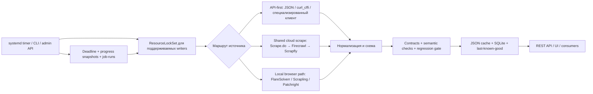

# Hearthstone Parses & Data API

[](https://github.com/Zulut30/hearthstone-parses/actions/workflows/tests.yml)

Кэширующий парсер и REST API для статистики Hearthstone. Сервис собирает данные
из HSReplay, HSGuru, Firestone, MetaStats, Hearthstone-Decks, HearthArena и
Vicious Syndicate, проверяет их качество и публикует нормализованные JSON-срезы.

- Production API: <https://api.hs-manacost.ru>
- Репозиторий: <https://github.com/Zulut30/hearthstone-parses>
- Каталог данных: [docs/DATA_CATALOG.md](docs/DATA_CATALOG.md)
- Полная документация API: [docs/API.md](docs/API.md)

> `GET /health` проверяет только доступность API. Он не гарантирует, что все
> парсеры успешно обновились и данные свежие. Для полной проверки используйте
> `freshness-check`, `quality-check` и `/ops/summary`.

## Что находится в системе

В текущем реестре **96 источников: 92 scrape + 4 dedicated pipeline**.
Авторитетный список генерируется из `app.sources.SOURCES` и хранится в
[docs/SOURCES.md](docs/SOURCES.md). Ручной перечень здесь намеренно не
дублируется: синхронизацию каталога проверяет pytest.

Основные группы данных:

- Constructed: карты, колоды, архетипы, мета, матчапы и история срезов.
- Battlegrounds: герои, существа, составы, аксессуары и детальная статистика.
- Arena: карты, классы, легендарные группы, winning decks и tier lists.
- Vicious Syndicate: Data Reaper Live и radar-графы.
- Производные наборы: fun/off-meta decks, SQL-индексы и patch-aware snapshots.

Каждый зарегистрированный набор доступен через:

```text
GET /datasets/{source_id}
```

Для новых интеграций предпочтительны типизированные `/v1/*` endpoints и поле
`data.structured`. Практический выбор endpoint и описание полей находятся в
[каталоге данных](docs/DATA_CATALOG.md).

## Архитектура



Ключевые компоненты:

| Компонент | Назначение |
| --- | --- |
| `app/sources.py` | Реестр источников, тип и допустимая свежесть. |
| `app/fetcher.py` | Оркестрация refresh, маршрутизация, сохранение последнего хорошего результата. |
| `app/firecrawl_backend.py` | Общая политика protected-page провайдеров. |
| `app/publish_gate.py` | Единая точка проверки кандидата перед публикацией. |
| `app/source_contracts.py` | Минимальные объёмы, обязательные поля и backend policy. |
| `app/dataset_regression.py` | Защита от резкого уменьшения или деградации набора. |
| `app/resource_locks.py` | Неблокирующие межпроцессные lock-файлы по ресурсам. |
| `app/job_run.py` | Дедлайны, прогресс и атомарные snapshots длительных заданий. |
| `app/storage.py`, `app/db.py` | JSON snapshots, резервные копии и SQLite/WAL. |
| `app/main.py` | REST API, admin/ops endpoints и web UI. |

## Политика провайдеров

Специализированные API-first маршруты используются там, где источник отдаёт
структурированные данные. Защищённые страницы могут идти через локальный
browser rotator или через общий cloud-scrape каскад. Для общего cloud-маршрута
порядок фиксирован:

1. **Scrape.do** — основной платный провайдер. Временные `429/5xx` получают
   ограниченный retry; Cloudflare challenge может переключить запрос на Super.
2. **Firecrawl** — первый резерв с ротацией настроенных ключей.
3. **Scrapfly** — последний резерв с отдельной ротацией ключей.

Переход к следующему провайдеру происходит после исчерпания ограниченных попыток
текущего: внутри Scrape.do возможны retry/Super escalation, а Firecrawl и
Scrapfly могут ротировать ключи. Ключи, cookies и URL с токенами очищаются из
ошибок и не должны попадать в логи. Детали и переменные конфигурации:
[docs/SCRAPE_PROVIDERS.md](docs/SCRAPE_PROVIDERS.md).

## Гарантии устойчивости

- Generic refresh и HSGuru matrix используют lock по конкретным ресурсам,
  поэтому занятый источник не должен блокировать независимые источники.
- Кандидат проходит структурную схему, source contract, semantic validation и
  regression gate до записи.
- При временном отказе upstream валидный предыдущий snapshot остаётся доступен
  как `effective_state=ok_cached`; причина последнего сбоя остаётся видимой.
- Последовательная JSON-запись использует временный файл и atomic replace;
  предыдущие datasets и statuses сохраняются в ограниченной ротации backups.
- HSGuru meta matrix имеет кооперативный дедлайн 60 минут, throttled snapshots
  прогресса и единый lock для matrix refresh и присоединения deck catalog.
- Ошибка best-effort telemetry не прерывает сам парсер.
- Состояния источника типизированы: `ok`, `partial`, `fetch_error`,
  `http_error`, `blocked_by_protection`, `proxy_required`, `quality_error`,
  `timed_out`, `never_fetched`.

Наличие last-known-good означает, что API продолжает обслуживать потребителей,
но не превращает неудачный refresh в успех. Именно поэтому liveness, freshness
и quality проверяются раздельно.

### Известные ограничения

- Дедлайн HSGuru проверяется между сетевыми операциями и пока не прерывает
  реально зависшую coroutine; heartbeat не работает отдельным фоновым циклом.
- Не все dedicated pipeline writers ещё используют `ResourceLockSet`.
- Общий `storage.write_json()` использует одинаковое имя `.tmp` и не рассчитан
  на две одновременные записи одного source без внешнего lock.
- Docker healthcheck проверяет liveness процесса, а не свежесть parser data.
- Strict preflight пока проверяет настроенный residential proxy как глобальную
  зависимость; его отказ может остановить API-first или cloud-provider job,
  которому этот proxy непосредственно не нужен.
- System-wide list endpoints пока вычисляют ETag через полный проход по JSON
  snapshots, поэтому их нельзя считать дешёвыми high-QPS endpoints.

Эти ограничения учитываются в operational gate ниже и являются следующими
приоритетами усиления системы.

## Хранение данных

Canonical Docker хранит runtime на host в `/srv/hs-data-api/data` и монтирует
его в контейнер как `/var/lib/hs-data-api`:

| Host path | Container path | Содержимое |
| --- | --- | --- |
| `data/datasets/` | `/var/lib/hs-data-api/datasets/` | Опубликованные JSON snapshots. |
| `data/statuses/` | `/var/lib/hs-data-api/statuses/` | Последнее состояние refresh. |
| `data/.locks/` | `/var/lib/hs-data-api/.locks/` | Lock-файлы; активное владение определяется `flock`. |
| `data/job-runs/` | `/var/lib/hs-data-api/job-runs/` | Прогресс длительных jobs. |
| `data/backups/` | `/var/lib/hs-data-api/backups/` | Предыдущие datasets/statuses. |
| `data/baselines/` | `/var/lib/hs-data-api/baselines/` | Regression baselines. |
| `data/publications/` | `/var/lib/hs-data-api/publications/` | Versioned candidate/published/quarantine records. |
| `data/control/` | `/var/lib/hs-data-api/control/` | Parser-control state и lock. |
| `data/firecrawl/`, `data/scrapfly/` | Одноимённые каталоги | Состояние ротации provider keys без самих ключей. |
| `data/logs/refresh-events.jsonl` | `/var/lib/hs-data-api/logs/refresh-events.jsonl` | Структурированные события. |
| `data/hs_parses.db` | `/var/lib/hs-data-api/hs_parses.db` | SQLite/WAL индексы. |

Canonical Docker читает секреты из игнорируемого Git файла
`/srv/hs-data-api/.env.docker`. `/etc/hs-data-api.env` относится к legacy host
units/CLI; browser sessions хранятся в закрытых файлах data directory.

## Быстрый старт через Docker

Требуются Docker и Docker Compose:

```bash
git clone https://github.com/Zulut30/hearthstone-parses.git
cd hearthstone-parses

cp .env.example .env.docker
chmod 600 .env.docker
# Заполните .env.docker своими ключами и настройками proxy.

docker compose up --build -d
curl -fsS http://127.0.0.1:18081/health
```

API может стартовать без запуска полного парсинга. Не выполняйте
`refresh --all`, пока не настроены proxy, provider keys и необходимые browser
sessions.

## Локальная разработка

Основное приложение работает на Python 3.12. Host-side exporter таймеров имеет
отдельный smoke-test на Python 3.11.

```bash
python3.12 -m venv .venv
source .venv/bin/activate
pip install -r requirements-dev.txt
python -m patchright install chromium

python -m pytest -q
python scripts/generate-source-catalog.py --check
```

Запуск API с локальным data directory:

```bash
HS_API_DATA_DIR="$PWD/data" \
HS_API_BIND_HOST="127.0.0.1" \
python -m app.server
```

## Команды оператора

На canonical Docker production выполняйте CLI внутри активного контейнера.
Raw `python -m app.cli` на host всегда пытается загрузить
`/etc/hs-data-api.env` и может неожиданно обратиться к production data.
Команды `proxy-check`, `preflight`, `canary`, `refresh` и dedicated refresh
обращаются к upstream и при fallback могут расходовать лимиты платных
провайдеров.

```bash
# Безопасность маршрута до источников и обязательные зависимости
docker exec hs-data-api python -m app.cli proxy-check
docker exec hs-data-api python -m app.cli preflight --strict
docker exec hs-data-api python -m app.cli canary --strict

# Один источник; non-zero, если свежий набор не опубликован
docker exec hs-data-api python -m app.cli refresh \
  --source hsreplay_cards_legend_1d \
  --require-all-ok

# Состояние уже сохранённых данных без платного refetch
docker exec hs-data-api python -m app.cli freshness-check --since-hours 48
docker exec hs-data-api python -m app.cli quality-check

# Длительный HSGuru pipeline
docker exec hs-data-api python -m app.cli refresh-hsguru-meta-matrix --concurrency 2
```

На production команды запускаются внутри штатного venv/container и через
systemd units из `systemd/`. Полная установка и расписание описаны в
[DEPLOY.md](DEPLOY.md).

## Как проверять стабильность

Минимальный production gate состоит из четырёх независимых проверок:

```bash
# 1. API отвечает
curl -fsS http://127.0.0.1:18081/health | jq .

# 2. Нет stale и cached-after-failure источников
docker exec hs-data-api python -m app.cli freshness-check --since-hours 48

# 3. Все cached datasets проходят contracts и quality threshold
docker exec hs-data-api python -m app.cli quality-check

# 4. Фоновые задания не завершились ошибкой
! systemctl --failed --no-pager --no-legend | grep -q hs-data-api
```

Для подробной диагностики с `X-API-Key`:

```bash
curl -fsS -H "X-API-Key: ${HS_API_KEY}" \
  http://127.0.0.1:18081/ops/health | jq .

curl -fsS -H "X-API-Key: ${HS_API_KEY}" \
  http://127.0.0.1:18081/ops/summary | jq .
```

Зелёный `/health` при non-zero `freshness-check` означает: API доступен, но
часть данных устарела. Это деградация parser layer, а не исправное состояние
всей системы.

## Основные endpoints

Public:

- `GET /health` — liveness API.
- `GET /sources`, `GET /sources/{source_id}` — реестр и статусы.
- `GET /datasets`, `GET /datasets/{source_id}` — cached parser output.
- `GET /v1/constructed/*`, `/v1/bg/*`, `/v1/arena/*` — типизированные API.
- `GET /v1/system/sources`, `/v1/system/datasets`, `/v1/system/health` —
  системные read-only представления.
- `GET /system/technologies` — публичное описание parser stack без секретов.
- `GET /ui`, `/ui/logs`, `/ui/technologies` — встроенный интерфейс.

Admin/ops, требует `X-API-Key`:

- `POST /admin/refresh`
- `PUT /admin/datasets/{source_id}`
- `GET /ops/health`
- `GET /ops/summary`
- `GET /ops/events`
- `GET /ops/trace/{trace_id}`
- `GET /ops/run/{run_id}`
- `GET /health/premium`

## Документация

- [docs/DATA_CATALOG.md](docs/DATA_CATALOG.md) — выбор endpoint и поля данных.
- [docs/SOURCES.md](docs/SOURCES.md) — генерируемый реестр всех источников.
- [docs/API.md](docs/API.md) — полная REST API документация.
- [docs/SCRAPE_PROVIDERS.md](docs/SCRAPE_PROVIDERS.md) — Scrape.do, Firecrawl и Scrapfly.
- [docs/HSREPLAY_ARCHETYPE_DATABASE.md](docs/HSREPLAY_ARCHETYPE_DATABASE.md) — SQL snapshots архетипов.
- [docs/SECURITY_AND_PARSING.md](docs/SECURITY_AND_PARSING.md) — proxy, cookies, auth и threat model.
- [DEPLOY.md](DEPLOY.md) — установка, systemd timers, обновление и recovery.

## Безопасность

- Не коммитьте `.env*`, cookies, storage state, токены и production datasets.
- Не передавайте секреты через query string или публичные endpoints.
- Используйте `HS_FETCH_REQUIRE_PROXY=true` для защищённых production-источников.
- Public API read-only; refresh и ops закрыты `X-API-Key`.
- Перед публикацией изменений запускайте tests, Docker build и secret scan.

## License

MIT
