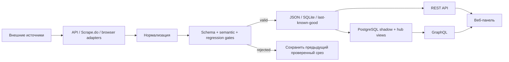

# Koloda Hearthstone Data Platform

[](https://github.com/Manacost-Labs/api.kolodahearthstone.com/actions/workflows/tests.yml)

Единая платформа данных Hearthstone: сбор и проверка статистики, центральная
база, REST/GraphQL API и закрытая веб‑панель. Проект объединяет данные
Constructed, Battlegrounds и Arena и сохраняет последний проверенный срез, если
внешний источник временно недоступен.

- **Веб‑панель:** <https://api.kolodahearthstone.com/>
- **GraphQL:** `POST https://api.kolodahearthstone.com/v1/`
- **REST API:** <https://api.kolodahearthstone.com/health>
- **Документация:** [docs/README.md](docs/README.md)
- **Каталог данных:** [docs/DATA_CATALOG.md](docs/DATA_CATALOG.md)
- **Wiki‑комплект:** [wiki/Home.md](wiki/Home.md)

> Веб‑панель закрыта GitHub OAuth и доступна только разрешённому аккаунту.
> Публичные read-only endpoints можно использовать без входа; полный доступ к
> базе и административные операции требуют scoped API‑токен.

## Что входит в платформу

| Слой | Что делает | Где находится |
| --- | --- | --- |
| Сбор данных | Получает данные HSReplay, HSGuru, Firestone, HearthArena, MetaStats, Hearthstone-Decks и Vicious Syndicate | `app/`, `systemd/` |
| Контроль качества | Проверяет структуру, полноту, семантику и регрессии до публикации | `app/publish_gate.py`, `app/source_contracts.py` |
| API | Отдаёт REST datasets, типизированные `/v1/*` endpoints и GraphQL | `app/main.py`, `app/routers/`, `app/graphql_api/` |
| Центральная база | Импортирует и нормализует каталоги и статистику в PostgreSQL | `platform/` |
| Веб‑панель | Показывает карты, героев, мету, архетипы, Arena, BG и состояние источников | `panel/` |
| Интеграции | Выдаёт scoped API‑токены и сохраняет совместимость со старыми REST‑контрактами | `app/api_tokens.py`, `panel/partials/api-token-manager.php` |

Авторитетный реестр источников генерируется из кода и опубликован в
[docs/SOURCES.md](docs/SOURCES.md): там всегда указаны актуальное количество,
тип, категория и freshness policy. Вручную поддерживать список не нужно.

## Какие данные доступны

| Раздел | Примеры |
| --- | --- |
| Constructed | Карты Standard/Wild, колоды, архетипы, мета, матчапы, история |
| Battlegrounds | Герои, существа, составы, аксессуары, рейтинговые срезы, изображения |
| Arena | Карты, классы, легендарные группы, winning decks, tier lists |
| Система | Источники, время обновления, качество, reliability и состояние jobs |
| Полная база | Таблицы и представления PostgreSQL через GraphQL `collections` и `records` |

Для выбора готового endpoint используйте [каталог данных](docs/DATA_CATALOG.md).
Технический реестр всех source ID находится в [каталоге источников](docs/SOURCES.md).

## Попробовать за минуту

Проверить доступность API:

```bash
curl -fsS https://api.kolodahearthstone.com/health | jq .
```

Посмотреть источники и время их последнего обновления:

```bash
curl -fsS https://api.kolodahearthstone.com/sources \
  | jq '.sources[] | {id, site, category, state: (.status.effective_state // .status.state), updated_at: .dataset_fetched_at}'
```

Получить один dataset:

```bash
curl -fsS \
  https://api.kolodahearthstone.com/datasets/hsguru_meta_standard_legend \
  | jq '.data.structured'
```

Выполнить GraphQL‑запрос:

```bash
curl -fsS https://api.kolodahearthstone.com/v1/ \
  -H 'Content-Type: application/json' \
  --data '{"query":"query { health { status databaseConnected sourceCount latestSyncAt } }"}' \
  | jq .
```

Больше готовых запросов: [docs/GETTING_STARTED.md](docs/GETTING_STARTED.md) и
[docs/INTEGRATION_GUIDE.md](docs/INTEGRATION_GUIDE.md).

## Веб‑панель

После входа на <https://api.kolodahearthstone.com/> доступны:

- каталоги карт BG, героев, скинов, питомцев, монеток и специальных коллекций;
- раздел **«Обзор и мета»** со всеми источниками, временем обновления и
  статистикой Constructed, Arena и Battlegrounds;
- подробные карточки архетипов, существ и героев с исходными полями;
- поиск, фильтры, сохранение параметров в URL и горизонтальная прокрутка таблиц;
- lightbox для изображений и отдельные представления обычных/золотых вариантов;
- раздел **«API‑токены»** для выпуска, просмотра и немедленного отзыва доступа.

Пошаговое руководство: [docs/WEB_PANEL.md](docs/WEB_PANEL.md).

## REST или GraphQL

Используйте REST, когда нужен конкретный готовый набор или обратная
совместимость. Используйте GraphQL, когда сервису нужны связанные данные,
точный набор полей или доступ к центральным таблицам.

| Задача | Рекомендуемый интерфейс |
| --- | --- |
| Получить готовую таблицу меты | REST `/v1/*` |
| Получить исходный snapshot парсера | REST `/datasets/{source_id}` |
| Запросить только нужные поля | GraphQL typed queries |
| Просмотреть любую таблицу центральной базы | GraphQL `collections` + `records` |
| Проверить liveness | REST `/health` |
| Проверить качество и свежесть всей системы | CLI gates + admin `/ops/*` |

Полные контракты: [REST API](docs/API.md),
[GraphQL](docs/GRAPHQL_API.md), [API‑токены](docs/API_TOKENS.md).

## Авторизация API

Для чтения полной базы передавайте токен со scope `database:read`:

```http
Authorization: Bearer khs_v1_<token-id>_<secret>
```

Токен проще всего выпустить в веб‑панели: **Доступ → API‑токены**. Новый секрет
показывается один раз. Для каждого сервиса создавайте отдельный токен с
минимальными правами и ограниченным сроком действия.

| Scope | Назначение |
| --- | --- |
| `database:read` | Чтение `collections` и `records` в GraphQL |
| `admin` | Refresh и закрытые `/admin/*`, `/ops/*` endpoints |
| `tokens:manage` | Выпуск, список и отзыв токенов |

## Как движутся данные



Ключевые гарантии:

- неполный или неверный ответ upstream не заменяет хороший dataset;
- запись snapshots выполняется атомарно;
- status отдельно показывает свежий результат, provisional, LKG и ошибку;
- `/health` проверяет доступность API, но не заменяет freshness/quality gates;
- секреты, cookies, production datasets и runtime‑кеши не входят в Git.

Подробнее: [архитектура](docs/ARCHITECTURE.md) и
[pipeline парсинга](docs/PARSER_PIPELINE.md).

## Локальная разработка

Требуются Python 3.12, PHP, Node.js и `actionlint`. Первый запуск:

```bash
git clone https://github.com/Manacost-Labs/api.kolodahearthstone.com.git
cd api.kolodahearthstone.com
make setup
make check
```

Запуск API с локальным каталогом данных:

```bash
HS_API_DATA_DIR="$PWD/data" \
HS_API_BIND_HOST="127.0.0.1" \
.venv/bin/python -m app.server
```

Docker‑вариант:

```bash
cp .env.example .env.docker
chmod 600 .env.docker
# Заполните только локальные настройки; не коммитьте файл.
docker compose up --build -d
curl -fsS http://127.0.0.1:18081/health
```

Не запускайте `refresh --all`, пока не настроены необходимые proxy/provider
credentials и browser sessions: такой запуск обращается к внешним источникам и
может расходовать платные лимиты.

## Основные команды

| Команда | Что проверяет |
| --- | --- |
| `make setup` | Создаёт Python‑окружение и ставит dev/panel зависимости |
| `make check` | Pytest, панель, платформу, PHP/JS/Shell contracts и Actions |
| `make provider-check` | Короткий regression gate provider‑слоя |
| `make lint-report` | Текущий Ruff baseline без массового исправления |
| `make security` | Security baseline проекта |
| `.venv/bin/python scripts/generate-source-catalog.py --check` | Сверяет `docs/SOURCES.md` с реестром в коде |

Порядок разработки и PR: [CONTRIBUTING.md](CONTRIBUTING.md).

## Структура репозитория

```text
app/            FastAPI, GraphQL, CLI, парсеры и quality gates
panel/          закрытая PHP-панель
platform/       PostgreSQL, миграции, импортеры и hub views
docs/           подробная документация и runbooks
wiki/           подготовленные страницы Wiki и навигация
scripts/        deployment, migration и operational entrypoints
systemd/        services и timers
tests/          unit, contract и regression tests
```

## Карта документации

- [Быстрый старт](docs/GETTING_STARTED.md)
- [Руководство по веб‑панели](docs/WEB_PANEL.md)
- [Интеграция внешнего сервиса](docs/INTEGRATION_GUIDE.md)
- [Каталог данных](docs/DATA_CATALOG.md)
- [REST API](docs/API.md)
- [GraphQL API](docs/GRAPHQL_API.md)
- [API‑токены](docs/API_TOKENS.md)
- [Архитектура](docs/ARCHITECTURE.md)
- [Pipeline парсинга](docs/PARSER_PIPELINE.md)
- [Deployment](DEPLOY.md)
- [Диагностика](docs/TROUBLESHOOTING.md)
- [Безопасность](docs/SECURITY_AND_PARSING.md)

## Безопасность

Не добавляйте в Git `.env*`, API‑токены, cookies, storage state, приватные URL,
дампы и production datasets. Не передавайте секреты через query string,
браузерный JavaScript или логи. Сообщения о security‑проблемах не публикуйте в
открытых issues — передавайте владельцу репозитория приватно.

## License

[MIT](LICENSE)
