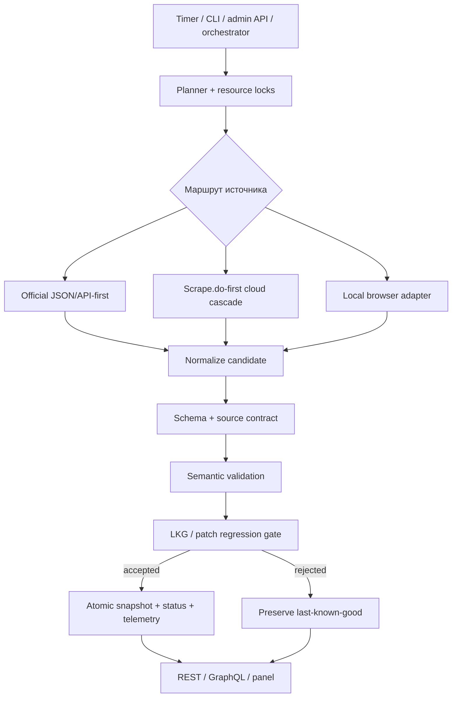

# Pipeline сбора и публикации данных

Парсер не публикует ответ внешнего сайта напрямую. Каждый кандидат проходит
единый путь: получение, нормализация, проверка, защита от регрессии и только
затем атомарная публикация.

## Поток данных



## Реестр источников

`app.sources.SOURCES` — единственный источник истины для:

- source ID;
- сайта и категории;
- типа `scrape` или `pipeline`;
- допустимой свежести;
- краткого назначения.

[SOURCES.md](SOURCES.md) генерируется из этого реестра. Pipeline sources имеют
отдельные команды/timers и не входят в обычный generic scrape planner.

## Выбор маршрута

Предпочтение отдаётся структурированному API или официальному JSON. Для
защищённых HTML‑страниц используются специализированные adapters, общий
Scrape.do-first cloud cascade и, где это допустимо, локальный browser path.

Маршрут выбирается до preflight, поэтому отсутствие зависимости одного типа не
должно блокировать независимые API-first источники. Каждый provider ограничен
числом попыток, timeout, concurrency и budget policy.

Подробности cloud cascade: [SCRAPE_PROVIDERS.md](SCRAPE_PROVIDERS.md).

## Проверки перед публикацией

### 1. Структура

Проверяется тип ответа, наличие обязательных разделов и возможность
нормализации. Challenge page, login page или HTML вместо ожидаемого JSON не
считаются успешным результатом даже при HTTP 200.

### 2. Source contract

Для каждого важного набора определены минимальное число строк, обязательные
поля и допустимая заполненность. Специализированный validator может проверять
ID, URL, timestamps, числовые диапазоны и принадлежность нужному режиму игры.

### 3. Семантика

Проверяются не только типы, но и смысловые ограничения: проценты/доли,
временные диапазоны, уникальность, полнота Standard/Wild частей и другие
domain‑инварианты.

### 4. Регрессия

Кандидат сравнивается с последним проверенным baseline. Резкое сокращение,
потеря ключевых разделов или смена patch identity блокируют публикацию.

## Состояния результата

| Состояние | Что опубликовано | Что делать потребителю |
| --- | --- | --- |
| `ok` | Новый проверенный snapshot | Использовать обычно |
| `provisional` | Проверенный early-patch snapshot с отдельными правилами | Использовать с пометкой post-patch |
| `ok_cached` / LKG | Предыдущий хороший snapshot | Использовать, но сигнализировать о деградации |
| `stale` | Snapshot старше policy | Решить, допустим ли возраст для продукта |
| `failed` | Полезного snapshot нет | Показать controlled empty/error state |

Статус последней попытки и состояние фактически отдаваемого dataset разделены.
Это не позволяет новой ошибке скрыться за старым успешным файлом.

## Поведение после патча

После нового патча объём данных закономерно меньше. Для ограниченного набора
источников применяется bounded early‑patch policy: принимается меньший, но всё
равно проверенный snapshot, помеченный `provisional`. Он не подменяет стабильный
baseline и после окончания early window снова проходит обычные пороги.

Правила для Arena, HSGuru, HSReplay и BG:
[CURRENT_PATCH_REFRESH.md](CURRENT_PATCH_REFRESH.md).

## Хранение

Публикация использует временный файл и atomic replace. В runtime могут
сосуществовать:

- текущий dataset;
- status последней попытки;
- last-known-good/baseline;
- SQLite indexes;
- PostgreSQL shadow и нормализованные `hub` views;
- append-only telemetry refresh outcomes.

Runtime, credentials и production data не являются исходниками и не должны
попадать в Git.

## Надёжность и observability

Каждый run получает deadline, progress snapshot и terminal state. Resource
locks предотвращают параллельную запись одного ресурса, не блокируя независимые
jobs. Reliability telemetry отдельно считает fresh publication, provisional,
LKG, failures и timeouts.

`/health` — только liveness. Полная операторская проверка:

```bash
docker exec hs-data-api python -m app.cli freshness-check --since-hours 48
docker exec hs-data-api python -m app.cli quality-check
```

С admin token дополнительно доступны `/ops/health`, `/ops/summary`, события и
trace/run details.

## AI‑диагностика

Опциональный AI‑слой получает только ограниченные числовые/boolean evidence без
сырого HTML, токенов, cookies, deck codes и приватных headers. В observe mode он
помогает классифицировать аномалию, но не может отменить deterministic gate и
принять невалидный dataset.

## Где менять поведение

| Задача | Основной модуль |
| --- | --- |
| Добавить source ID | `app/sources.py` |
| Изменить fetch routing | `app/fetch_routes.py`, `app/fetcher.py` |
| Изменить cloud provider policy | `app/firecrawl_backend.py` |
| Изменить contract | `app/source_contracts.py` |
| Изменить validation | `app/source_validators.py`, `app/publish_gate.py` |
| Изменить regression policy | `app/dataset_regression.py` |
| Изменить запись snapshots | `app/storage.py`, `app/db.py` |
| Изменить telemetry | `app/reliability_telemetry.py` |

Изменение contract, storage schema или publication gate требует regression
tests и полного `make check`.
