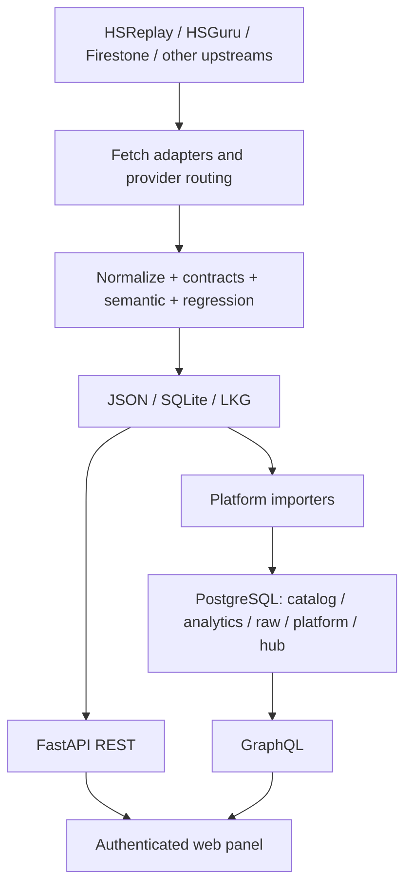

# Архитектура

## Слои

## Компоненты

| Каталог | Ответственность |
| --- | --- |
| `app/` | FastAPI, CLI, fetchers, validators, storage и telemetry |
| `app/routers/` | Versioned REST endpoints |
| `app/graphql_api/` | Read-only GraphQL schema/repository |
| `panel/` | Authenticated PHP web panel |
| `platform/` | PostgreSQL, migrations, importers, verification и backups |
| `scripts/` | Deployment/migration/operational entrypoints |
| `systemd/` | Services и schedules |
| `docs/` | References и runbooks |
| `tests/` | Unit, contract и regression tests |

## Публикация dataset

1. Planner выбирает sources и resource locks.
2. Route выбирает API-first, cloud или browser adapter.
3. Candidate нормализуется.
4. Schema/source contract проверяет форму и полноту.
5. Semantic validation проверяет domain‑инварианты.
6. Regression gate сравнивает с baseline и patch identity.
7. Accepted snapshot сохраняется атомарно.
8. Rejected snapshot не заменяет last-known-good.
9. REST/UI/импортеры читают только опубликованные данные.

## Центральная база

PostgreSQL использует schemas:

- `catalog` — игровые сущности;
- `analytics` — snapshots и нормализованная статистика;
- `raw` — импортированные совместимые payloads;
- `platform` — sync/operational metadata;
- `hub` — стабильные представления для consumers.

До завершения cutover sync остаётся однонаправленным. Storage можно менять под
`hub`/API без изменения consumer contract.

## Границы доверия

- public read-only endpoints не принимают изменения данных;
- complete database access требует `database:read`;
- admin/ops требуют `admin`;
- token lifecycle требует `tokens:manage`;
- external orchestrator имеет отдельный narrow credential;
- provider keys/cookies находятся только в runtime secret storage.

## Ключевые решения

- PostgreSQL выбран как будущая система записи и слой интеграции;
- custom panel заменил неудобный NocoDB UI;
- REST compatibility сохраняется во время миграции;
- GraphQL — единая точка новых связанных интеграций;
- LKG и deterministic gates важнее публикации «любого свежего ответа».

Подробно: [docs/ARCHITECTURE.md](../docs/ARCHITECTURE.md) и
[ADRs](../platform/docs/decisions/).
