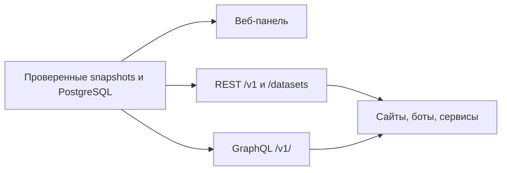

# Koloda Hearthstone Data Platform

Добро пожаловать в Wiki единой платформы данных Hearthstone. Здесь собраны
пользовательские инструкции, описание API, каталог данных, архитектура и
операционные runbooks.

## Что это за система

Платформа объединяет:

- закрытую веб‑панель с каталогами и игровой статистикой;
- REST API с готовыми datasets и типизированными endpoints;
- GraphQL API для связанных запросов и полной PostgreSQL‑базы;
- единый автоматически генерируемый реестр источников и отдельных pipeline;
- quality gates, last-known-good snapshots и контроль свежести;
- scoped API‑токены для внешних сервисов.

Основной адрес: <https://api.kolodahearthstone.com/>.

## Начните здесь

| Ваша задача | Страница |
| --- | --- |
| Впервые открыть систему | [Быстрый старт](Getting-Started.md) |
| Найти данные в панели | [Веб‑панель](Web-Panel.md) |
| Подключить внешний сервис | [REST и GraphQL API](API.md) |
| Понять доступные данные | [Каталог данных](Data-Catalog.md) |
| Выпустить токен | [Авторизация и токены](Authentication.md) |
| Понять устройство | [Архитектура](Architecture.md) |
| Обновить/восстановить сервис | [Эксплуатация](Operations.md) |
| Найти причину ошибки | [Диагностика](Troubleshooting.md) |
| Получить короткий ответ | [FAQ](FAQ.md) |

## Три интерфейса одной базы

- **Панель** — для просмотра, поиска и управления доступом.
- **REST** — для готовых срезов и обратной совместимости.
- **GraphQL** — для точного набора полей и полной центральной базы.

## Важное о свежести

`GET /health` подтверждает, что API отвечает, но не гарантирует свежесть всех
источников. Для оценки данных смотрите state и timestamp в `/sources` или на
вкладке **«Обзор»** веб‑панели.

Если новый refresh не прошёл проверки, платформа продолжает отдавать последний
проверенный snapshot и помечает его как LKG/`ok_cached`. Это контролируемая
деградация, которую monitoring должен отличать от свежей публикации.

## Полная документация в репозитории

Wiki даёт удобную навигацию. Исчерпывающие references и генерируемые каталоги
находятся в основном репозитории:

- [documentation index](../docs/README.md);
- [REST reference](../docs/API.md);
- [GraphQL reference](../docs/GRAPHQL_API.md);
- [полный каталог данных](../docs/DATA_CATALOG.md);
- [автоматический список источников](../docs/SOURCES.md);
- [deployment guide](../DEPLOY.md).

## Безопасность

Не публикуйте токены, cookies, `.env`, private headers, production datasets и
дампы. API‑токен передавайте только в `Authorization: Bearer ...` и храните в
server-side secret manager.
